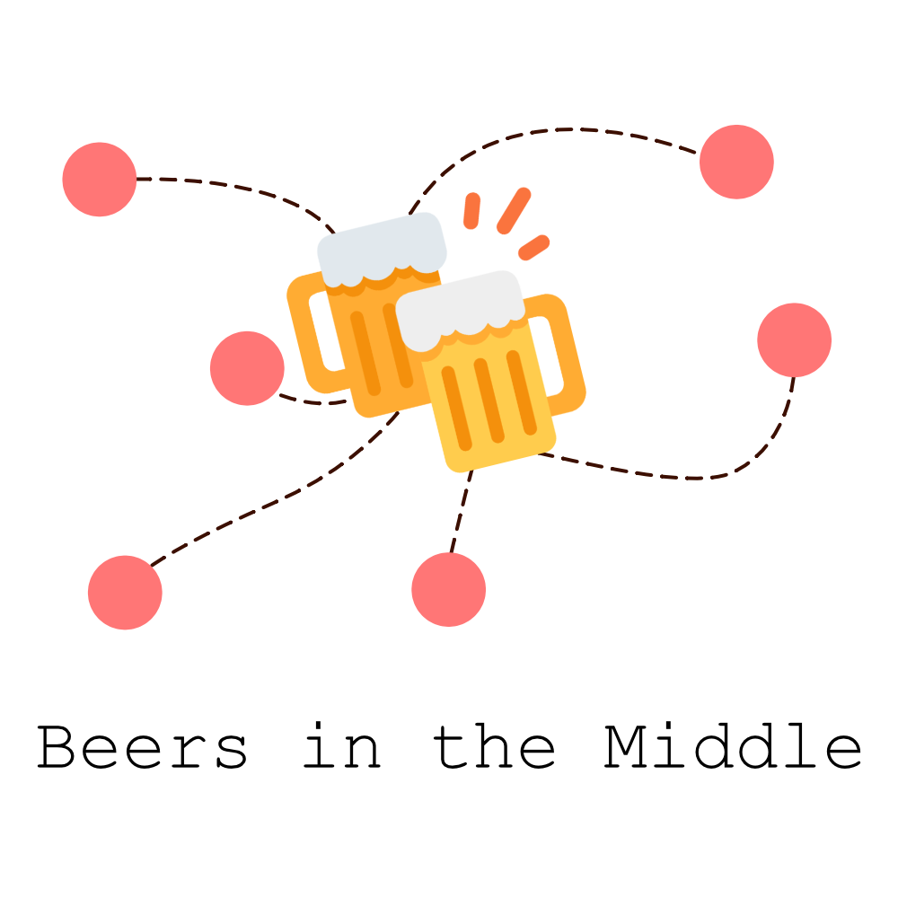

# Beers in the Middle 🍻

BITM helps groups of friends find the perfect place to meet for drinks or food by finding the average distance between each friend. Using the Foursquare API we're able to find the best bars, restaurants and clubs for you and your friends to have the best evening out at the most convenient place for all.

## Built With

- [Create React App](https://github.com/facebook/create-react-app)
- [Now](https://zeit.co) - Deployment and lambdas

[](#)

## To Run

### Environment Variables

You need all of these envirables for the app to run:

`GMAPS` - Google Maps API key for the server

`FOURSQUARE_API_CLIENT` - Client for Foursquare

`FOURSQUARE_API_SECRET` - Secret for Foursquare

Ask @omonk for access if you don't have.

### Global Package(s)

Install [`now`](https://github.com/zeit/now) globally.

```bash
yarn global add now
```

then

### Actually running the damn thing

```bash
now dev --listen 127.0.0.1:8080
```

## Contributing

Pull requests and issues are very welcome!

## Authors

- **Ollie Monk** - _Main author_ - [Github](https://github.com/omonk)

## Acknowledgments

- Hat tip to anyone whose code was used
